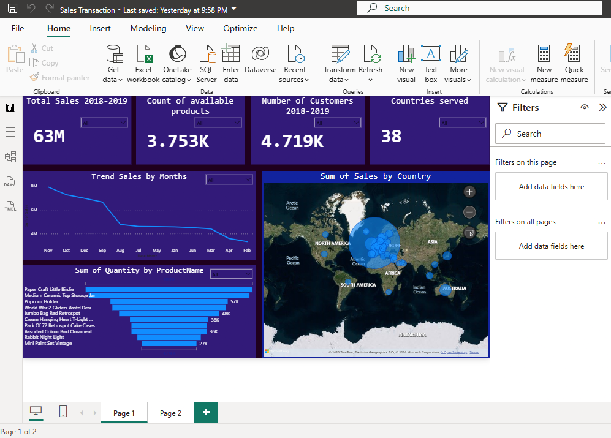

# Sales-Transaction-Analytics
A data analytics project focused on analyzing sales transactions to identify revenue trends, customer purchasing behavior, top-selling products, and key business performance metrics using Excel, SQL, and Power BI.
# 📊 Sales Transaction Analysis Dashboard

## 📖 Project Overview

This project presents an end-to-end analysis of a sales transaction dataset using **Excel**, **SQL**, and **Power BI**. The objective was to transform raw sales data into meaningful business insights through data cleaning, exploratory data analysis (EDA), and interactive dashboard development.

The dashboard provides stakeholders with a comprehensive view of sales performance, customer purchasing behavior, and product trends to support data-driven business decisions.

---

## 🎯 Project Objectives

- Analyze monthly sales performance.
- Identify top-selling products.
- Evaluate customer purchasing behavior.
- Monitor key sales performance indicators (KPIs).
- Generate actionable business insights to support strategic decision-making.

---

## 🛠️ Tools & Technologies

- Microsoft Excel
- SQL
- Power BI

---

## 📋 Key Tasks Performed

- Cleaned and transformed raw sales data to improve data quality and consistency.
- Performed exploratory data analysis (EDA) to uncover sales patterns and trends.
- Analyzed customer purchasing behavior and product performance.
- Created calculated measures and KPIs for business reporting.
- Designed and developed an interactive Power BI dashboard.
- Generated actionable insights and business recommendations from the analysis.

---

## 📈 Dashboard Preview

---

## 📊 Dashboard Highlights

- Total Sales
- Monthly Sales Trend
- Top-Selling Products
- Sales by Category
- Customer Purchasing Analysis
- Revenue Performance
- Interactive Filters and Slicers

---

## 💡 Key Insights

- Identified the highest-performing products based on sales volume.
- Analyzed monthly revenue trends to highlight peak sales periods.
- Evaluated customer purchasing patterns and product demand.
- Highlighted business opportunities to improve sales performance and customer engagement.
- Delivered insights to support data-driven business decision-making.

---

## 📁 Repository Contents

- `README.md`
- `Sales Transaction Analysis.pbix`
- `sales-dashboard.png`

---

## 🚀 Skills Demonstrated

- Data Cleaning
- Data Transformation
- Exploratory Data Analysis (EDA)
- SQL Querying
- Data Visualization
- Dashboard Development
- KPI Reporting
- Business Intelligence
- Data Storytelling
- Business Insights Generation

---

## 👨‍💻 Author

**Daniel Ebiduwa**

Data Analyst | Full-Stack Developer | Digital Mentor
